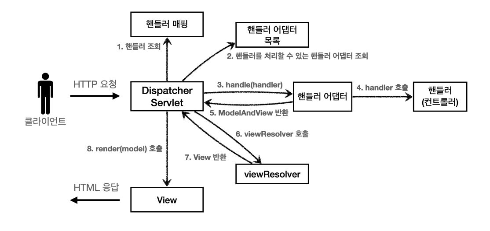

# 스프링 MVC 1편 - 백엔드 웹 개발 핵심 기술

### 섹션 1. 프레임 워크 만들기(완료)
### 섹션 2. 웹 애플리케이션 이해(완료)
### 섹션 3. 서블릿(완료)
### 섹션 4. 서블릿, JSP, MVC 패턴(완료)
### 섹션 5. 프레임 워크 만들기(완료)
### 섹션 6. 스프링 MVC - 구조 이해(완료)

---
26.09.27 학습 - [ 섹션 6. 스프링 MVC - 구조 이해 ]

    ```
    [application.properties 설정]

        # Tomcat HTTP/1.1 프로토콜 처리 관련 로그를 가장 상세하게(TRACE 단계) 출력
        # (HTTP 요청/응답 헤더, 커넥션 연결/해제 과정 등 네트워크 통신 메시지 확인용)
        logging.level.org.apache.coyote.http11=trace

        # 컨트롤러가 반환하는 뷰 이름 전후에 경로(/WEB-INF/views/)와 확장자(.jsp)를 자동으로 붙여주는 설정
        # 예: "members" 반환 -> "/WEB-INF/views/members.jsp" 파일 연결
        spring.mvc.view.prefix=/WEB-INF/views/
        spring.mvc.view.suffix=.jsp


        @RequestMapping("/members")
        public String members() {
            return "members"; // 논리적 뷰 이름 반환
        }



---
26.09.26 학습

    Spring MVC는 전부 인터페이스화 되어있음
    -> @어노테이션(컨트롤러)
    -> OCP를 잘 지킴: 인터페이스, 구현 분리가 잘 되어있음

인터페이스 따로, 구현은 구현대로 따로 로직 작성
